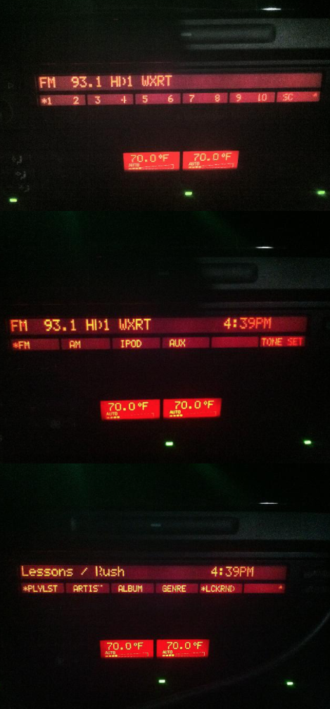

# bmw_radio
custom iBus radio for BMWs

It was an interesting project born out of necessity - aren't they all? I loved the engineering of the BMW 740i, but unfortunately the technology was out of date. I wanted support for iPod playback and HD Radio, so I taught myself EE and audio engineering and set out to build a replacement radio headunit with these features. It turned out really well imo. It integrated perfectly with the other car systems and it worked like it was from the factory. As a bonus, the audio fidelity was much improved with the higher gain and signal to noise ratios of the sources.

Note, the code is quite old, and is designed for a low power embedded system, so some short-cuts were taken, but still it is pretty understandable. There are no "threads" - there is a main loop that calls into each device to "do work", so obviously the "do work" must be short in duration or other devices will not be handled. To that end, it relies on hardware buffered serial IO, so that the handling code has some headroom in responding to events.

More about this progect can be found at http://www.bimmerboard.com/forums/posts/1052355

